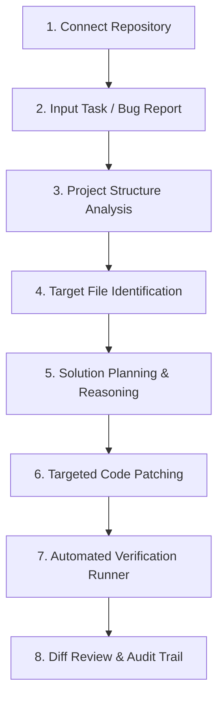

# DevForge AI ⚡

> **Autonomous AI Developer Agent for Understanding, Modifying, and Verifying Codebases**

DevForge is a modern developer tool that bridges the gap between natural language developer intent and real codebase execution. It connects directly to repositories, analyzes project structure, identifies relevant files, plans solutions, stages targeted code modifications, and verifies changes using real test and build suites.

---

## 🚀 Core User Workflow



1. **Repository Connection**: Connect a local repository path or clone directly from GitHub.
2. **Natural Language Task Dispatch**: Developer provides a feature request, bug description, or refactoring prompt.
3. **Structure Analysis**: DevForge recursively maps the repository filesystem, detects language ecosystems (TypeScript, Python, Go, Rust, Java), and indexes test/build configurations.
4. **Target File Identification**: Scores and ranks source files relevant to the task based on keyword matches, AST patterns, and file metadata.
5. **Solution Planning**: Generates problem diagnoses, step-by-step resolution sequences, and risk evaluations.
6. **Code Patching**: Computes targeted code modifications and generates standard unified diff hunks.
7. **Automated Verification Runner**: Executes real test/build commands (e.g. `npm test`, `pytest`, `cargo test`) in an isolated subprocess, captures real stdout/stderr, and parses exit codes.
8. **Diff Review & Summary**: Presents side-by-side/unified diffs, execution logs, and assertion breakdowns.

---

## 🛠️ Technology Stack

- **Framework**: Next.js 15 (App Router, Server Actions & Route Handlers)
- **Frontend**: React 19, TypeScript, Vanilla CSS Design System (Sleek Dark Slate Developer Theme)
- **Icons**: Lucide React
- **VCS & Git Engine**: Simple-Git, Child Process CLI execution
- **Filesystem & Code Analysis**: Node.js `fs/promises`, Custom Keyword & AST File Relevance Engine
- **Verification Engine**: Subprocess Test Runner with timeout protection and test summary parser
- **State & Telemetry**: Persistent file-backed store (`.devforge_data/store.json`)

---

## 📁 Repository Structure

```text
devforge-ai/
├── src/
│   ├── app/                      # Next.js App Router
│   │   ├── api/                  # REST API Route Handlers
│   │   │   ├── health/           # System status & environment checks
│   │   │   ├── config/           # Safe configuration telemetry
│   │   │   ├── repositories/     # Repo connection, cloning & scanning
│   │   │   └── tasks/            # Task management & agent execution pipeline
│   │   ├── settings/             # Environment & provider settings
│   │   ├── globals.css           # Modern developer design tokens
│   │   ├── layout.tsx            # Root layout with header & status indicators
│   │   └── page.tsx              # Interactive developer dashboard & agent console
│   ├── lib/                      # Core backend & agent modules
│   │   ├── agent/                # Multi-stage orchestrator & pipeline
│   │   ├── analyzer/             # Workspace directory scanner & relevance engine
│   │   ├── config.ts             # Environment variable configuration
│   │   ├── git/                  # Real Git operations (status, clone, diff)
│   │   ├── storage/              # Persistent session & task store
│   │   └── verification/         # Real test runner & subprocess execution
│   └── types/                    # Shared TypeScript domain models
├── .env.example                  # Environment configuration template
├── .gitignore                    # Git ignore definitions
├── package.json                  # Dependencies & scripts
├── tsconfig.json                 # TypeScript compiler configuration
└── README.md                     # Project documentation
```

---

## ⚡ Getting Started Locally

### Prerequisites

- **Node.js**: `v20.0.0` or higher (`v24+` tested)
- **npm**: `v10.0.0` or higher
- **Git**: Installed and available in PATH

### 1. Installation

```bash
git clone https://github.com/ysirishchandra-lgtm/devforge-ai.git
cd devforge-ai
npm install
```

### 2. Configure Environment

Copy the example environment configuration:

```bash
cp .env.example .env.local
```

Edit `.env.local` to configure optional AI providers or tokens:

```env
PORT=3000
AI_PROVIDER=gemini
GEMINI_API_KEY=your_gemini_api_key_here
GITHUB_PERSONAL_ACCESS_TOKEN=your_token_here
AUTO_RUN_VERIFICATION=true
```

### 3. Run Development Server

```bash
npm run dev
```

Open [http://localhost:3000](http://localhost:3000) in your browser to access the DevForge Developer Console.

---

## 🔒 Security & Architecture Rules

- **Zero Fake Functionality**: Real Git subprocess operations, real filesystem scans, and real test execution.
- **No Leaked Secrets**: All secret keys (`GEMINI_API_KEY`, `GITHUB_TOKEN`) stay strictly on the backend and are masked in API responses.
- **Modular Isolation**: Clear separation between UI presentation, backend API endpoints, repository analysis, and verification runners.

---

## 👥 Hackathon Team

- **Project**: DevForge AI
- **Repository**: [https://github.com/ysirishchandra-lgtm/devforge-ai.git](https://github.com/ysirishchandra-lgtm/devforge-ai.git)
